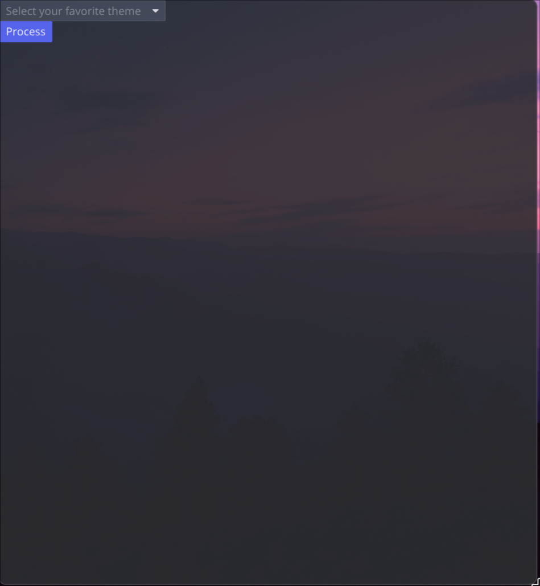

# How to use this program

# Template manual
## Let's say you need to configure Waybar. In this case, you need to create the following files in the ~/.config/waybar folder.
1. style.css - main style file
2. style-temp.css - your template file

## Example of template file:
```css
* {
    font-family: "JetBrains Mono";
    font-weight: bold;
    font-size: 14px;
    color: #{{base05}};
}
```

# Theme file manual
## Example of source file(All fields are optional)
```json
{
  "scheme": "Catppuccin Mocha",
  "base00": "1e1e2e",
  "base01": "181825",
  "base02": "313244",
  "base03": "45475a",
  "base04": "585b70",
  "base05": "cdd6f4",
  "base06": "f5e0dc",
  "base07": "b4befe",
  "base08": "f38ba8",
  "base09": "fab387",
  "base0A": "f9e2af",
  "base0B": "a6e3a1",
  "base0C": "94e2d5",
  "base0D": "89b4fa",
  "base0E": "cba6f7",
  "base0F": "f2cdcd"
}
```

## You can use more fields, but for theme preview in GUI MODE is desirable to use fields from example 

# Config manual

## Structure of config
1. data - your source of colors and etc. Optional in GUI MODE
2. data_dir - your theme directory for showing list of themes in GUI MODE. Optional. By default path is ~/.config/muscat/themes
3. targets - your configs for applying theme
4. wallpapers - you can link your theme with wallpaper. Optional  
5. restarts - programms to restart after applying theme. Optional

## First you need to set up your config

1. Open ~/.config/muscat/config.jsonc
2. Enter your settings. For reference:

```json
{
  "data": "~/dotfiles/.config/muscat/themes/catppuccin.json",
  
  "data_dir": "~/.config/muscat/themes",
    
  "targets": [
    "~/dotfiles/.config/waybar/config.jsonc",
    "~/dotfiles/.config/waybar/style.css",
    "~/dotfiles/.config/swaync/style.css",
    "~/dotfiles/.config/cava/config",
    "~/dotfiles/.config/starship.toml",
    "~/dotfiles/.config/kitty/kitty.conf",
    "~/dotfiles/.config/gtk-3.0/gtk.css",
    "~/dotfiles/.config/gtk-4.0/gtk.css",
    "~/dotfiles/.config/vesktop/themes/theme.css",
    "~/dotfiles/.config/zed/settings.json",
    "~/dotfiles/.config/zed/themes/base16.json",
    "~/dotfiles/.config/hypr/hyprland.conf",
    "~/dotfiles/.config/alacritty/alacritty.toml",
    "~/dotfiles/.config/rofi/theme.rasi",
  ],
  
  "wallpapers": [
    { "catppuccin": "~/Pictures/Wallpapers/purple-sunrise.png" },
    { "gruvbox": "~/Pictures/Wallpapers/gruv-abstract-maze.png" },
    { "everforest": "~/Pictures/Wallpapers/green-code.png" },
    { "kanagawa": "~/Pictures/Wallpapers/monochrome.png" },
    { "da-one-black": "~/Pictures/Wallpapers/monochrome.png" },
  ],
  
  "restarts": [
    "waybar",
    "swaync",
    "zed",
  ]
}
```

# GUI MODE
## To enable GUI MODE you need to run this program with "--gui" argument and select your theme



# CLI MODE
## In CLI mode, "restarts" field is still optional, but you must fill "data" field

# Special thanks
## You can check this [fork](https://github.com/milestale/RGBT) with improved English README