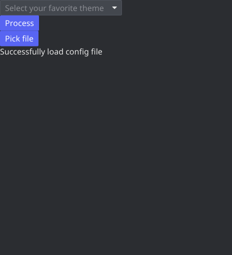
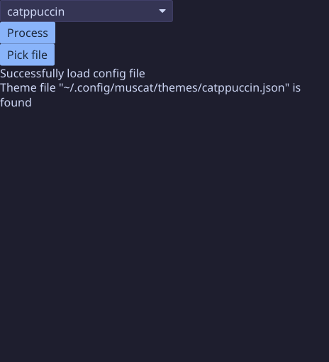

# 🎨 Muscat - Theme Manager for Your Linux Desktop
**Muscat** is a theme management tool for Linux desktops. It applies consistent color schemes across your entire workflow - from your terminal to your window manager, status bar, and beyond.

# Features
- 🎨 **Universal Theme Management** - Apply color schemes to all your favorite apps at once
- 🖥️ **GUI & CLI Modes** - Use the visual theme picker or command-line for scripting
- 🔄 **Auto Restart** - Automatically restart affected applications after theme changes
- 🖼️ **Wallpaper Integration** - Link wallpapers to themes for a complete desktop experience
- 📦 **Base16 Compatible** - Works with the popular Base16 color scheme format
- ⚡ **Instant Preview** - See your theme changes in real-time via the GUI

# Installation

## Requirements
- Linux distribution
- Rust/Cargo
- Git for cloning repository

## From source
```bash
# Clone the repository
git clone https://github.com/grapeco/muscat
cd muscat

# Build and install 
cargo install --path .
```

## Nix
Add to your `flake.nix`
```nix
inputs.muscat.url = "github:grapeco/muscat";
```

Add to your `configuration.nix`
```nix
environment.systemPackages = [
  inputs.muscat.packages.${pkgs.stdenv.hostPlatform.system}.default
];
```

# Configuration

## Main Config
The main config file located in `~/.config/muscat/config.jsonc`

### Structure
| Field | Type | Required | Description | 
| ----- | ---- | -------- | ----------- |
| `theme` | string | ❌ (Required for CLI) | Name of your color theme (e.g., **catppuccin**) |
| `targets` | array | ✅ | List of your configs to apply theme |
| `wallpapers` | array | ❌ | Theme -> Wallpaper mappings |
| `restarts` | array | ❌ | Programs to restart after applying theme |

### Example
```json
{
  "theme": "catppuccin",
    
  "targets": [
    "~/.config/waybar/config.jsonc",
    "~/.config/waybar/style.css",
  ],
  
  "wallpapers": [
    { "catppuccin": "~/Pictures/Wallpapers/NixOs.png" },
    { "gruvbox": "~/Pictures/Wallpapers/gruv-abstract-maze.png" },
  ],
  
  "restarts": [
    "waybar",
    "zed",
  ]
}
```
**Note:** `targets` expects the paths to your configs, not the template file paths. The template file should be named `[target-filename]-temp.[ext]` in the same directory. Example: For `style.css`, create `style-temp.css`.

## Theme files
Theme files define color palettes. While Muscat GUI preview is **Base16 compatible**, you're not limited to Base16 fields - you can use **any custom fields** you need for your templates.

Place your theme files in `~/.config/muscat/themes/`

Example with Base16 fields: `~/.config/muscat/themes/catppuccin.json`
```json
{
  "scheme": "Catppuccin Mocha",
  "author": "https://github.com/catppuccin/catppuccin",
  "base00": "1e1e2e",
  "base01": "181825",
  "base02": "313244",
  "base03": "45475a",
  "base04": "585b70",
  "base05": "cdd6f4",
  "base06": "f5e0dc",
  "base07": "b4befe",
  "base08": "f38ba8",
  "base09": "fab387",
  "base0A": "f9e2af",
  "base0B": "a6e3a1",
  "base0C": "94e2d5",
  "base0D": "89b4fa",
  "base0E": "cba6f7",
  "base0F": "f2cdcd"
}
```
Example with custom fields:
```json
{
  "scheme": "My Custom Theme",
  "background": "1e1e2e",
  "foreground": "cdd6f4",
  "accent": "89b4fa",
  "error": "f38ba8",
  "success": "a6e3a1",
  "warning": "f9e2af"
}
```

## Template files
Template files are application configs with **placeholder variables** that Muscat replaces with values from your theme file.

**Syntax**: {{field_name}} where `field_name` matches with your theme.json

**Example:** `~/.config/waybar/style-temp.css`
```css
* {
    font-family: "JetBrains Mono";
    font-weight: bold;
    font-size: 14px;
    color: #{{base05}};
}

window {
    background: #{{base00}};
}
```
How it works:
1. You create a template file (e.g., style-temp.css) with {{field_name}} placeholders
2. Muscat reads your selected theme file
3. It generates the final file (e.g., style.css) with actual values
4. Applications use the generated file

# Usage

## GUI Mode
Launch the graphical theme picker:
```bash
muscat --gui
```

**Features:**
- 🖼️ Visual preview of all available themes
- 🎯 Click to apply themes instantly
- 🖿 Integrated file picker 

**Screenshots:**

Before applying theme:



After applying theme:



## CLI Mode
For scripting and automation:
```bash
muscat
```
